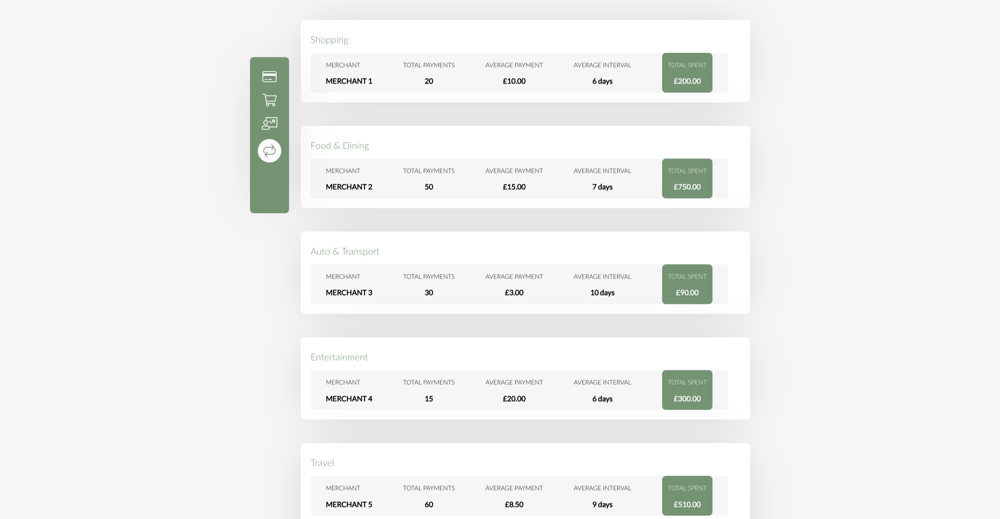

# Finance-Tracker

Finance tracker is a web app that analyses the transaction history of a bank account.

## Features

Finance Tracker uses the [True Layer API](https://www.truelayer.com) to get all of the transactions from a persons bank account and:

#### combines account balances:

    
#### shows the user a 3 month map of all of thier transactions that they can look through day by day:

    
#### gives the user a graph of thier average daily spend over the last 3 months:

    
#### analyses the users transaction history and shows them transactions that they have made repeatedly:

